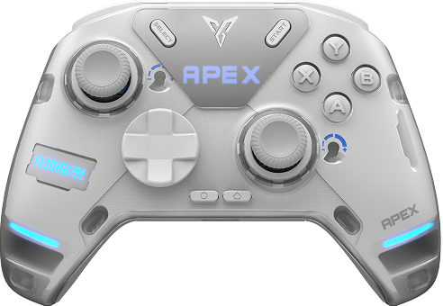

<p align="center">
  
</p>

<h1 align="center">Space Station for Mac</h1>

<p align="center">
  Native, open-source macOS companion for <b>Flydigi controllers</b> — lighting, LCD animations, profiles,
  macros, triggers and more. What Flydigi Space Station does on Windows, on your Mac.
</p>

<p align="center">
  <a href="https://github.com/uiltonlopes/flydigi-space-station-mac/releases"></a>
  
  
  <a href="LICENSE"></a>
  <a href="https://buymeacoffee.com/uiltonlopes"></a>
</p>

<p align="center">
  Made by <b>Uilton Lopes</b> ·
  <a href="https://github.com/uiltonlopes">GitHub</a> ·
  <a href="https://www.linkedin.com/in/uiltonlopes">LinkedIn</a> ·
  <a href="https://buymeacoffee.com/uiltonlopes">Buy me a coffee</a>
</p>

> **Status: usable, pre-release.** Unofficial and not affiliated with Flydigi. The USB protocol was
> reverse-engineered and verified on real hardware; the app covers what Space Station 4 offers for the
> **Apex 4** except firmware flashing and keyboard/mouse mapping.
> See [`docs/protocol.md`](docs/protocol.md) and [`docs/roadmap.md`](docs/roadmap.md).

## Features

Laid out like Space Station 4 so owners feel at home, built with SwiftUI:

| | |
|---|---|
| **Common** | lighting (mode, colours, brightness, cycle time; applied live) and grip vibration |
| **Button** | click / turbo / macro / special per key, with "press the button on the pad" capture (paddles included, in both USB modes) |
| **Joystick** | curves (incl. a custom two-point curve), dead zone, edge, live readout |
| **Gyro** | map motion to a stick, activation key, sensitivity, dead zone |
| **Trigger** | ForceAdapt modes (race, sniper, recoil, lock, vibration) with live preview, start/end |
| **Macros** | on-board macros with a step editor, timeline and recording from the pad |
| **Screen** | GIF/PNG/JPEG editor (pan, zoom, fit/fill, trim, frame interval, exact 160 × 80 preview) or Flydigi's official animation library |
| **Adaptive Trigger** | Flydigi's per-game preset list |
| **Settings** | firmware update check with Flydigi's release note (translated on-device), USB mode, language, helper |
| **Profiles** | 4 on-board slots with rename, apply and revert; battery, link and mode in the sidebar and in the menu bar |

Live input works in both USB modes; in DInput the app reads the raw report, so paddles M1–M4, Fn and Home
light up too. Languages: English and Português (Brasil).

## Install (pre-release)

Download `SpaceStation-<version>.dmg` from the [Releases](https://github.com/uiltonlopes/flydigi-space-station-mac/releases)
page, drag the app to Applications and follow [`docs/install.md`](docs/install.md) (release builds are
Developer ID signed and notarized; XInput mode needs the bundled helper).
Changes per version: [`CHANGELOG.md`](CHANGELOG.md).

## Why

Flydigi only ships configuration software for Windows. The controller works fine as a gamepad on
macOS, but you cannot change lighting, upload GIFs to the screen, or tune triggers and sticks.
Running the Windows app in a VM does not work either: Apple's own Xbox controller driver claims
the device before the VM can.

## How it works (short version)

- In **DInput** mode the pad exposes a vendor HID interface that macOS leaves alone → the app talks
  to it directly, no privileges needed (LEDs, config, profiles, raw input).
- In **XInput** mode Apple's driver owns the device; a small privileged helper (installed once via
  `SMAppService`) borrows the USB interface only while a command runs. The LCD upload needs this mode.
- Screen images are LVGL v8 / RGB565 big-endian, 160 × 80, up to 35 frames.

Details: [`docs/architecture.md`](docs/architecture.md) · [`docs/protocol.md`](docs/protocol.md) ·
[`docs/firmware-update.md`](docs/firmware-update.md) · [`docs/design-ss4-reference.md`](docs/design-ss4-reference.md).

## Supported hardware

| Controller | Device id | Firmware tested | Status |
|---|---|---|---|
| Flydigi Apex 4 (`k2`) | 84 | 6.8.3.0 (2026-09) | supported — LED, screen, profiles, macros, ForceAdapt, settings |
| Apex 4 EVA / STN / AC / GS / SRS / HSH | 86, 87, 92, 93, 102, 103, 104 | — | same family, untested |
| Apex 3, Vader 3 / 3 Pro, older | see catalogue | — | classic protocol, unsupported (help wanted) |
| Apex 5 / 6, Vader 4 Pro, Vader 5 | 128+ | — | new protocol (VID 0x37D7), unsupported |

USB-C cable or the charging base's 2.4 GHz receiver (screen upload is cable-only). Bluetooth cannot be
configured. Want your controller added? Read [`docs/adding-a-controller.md`](docs/adding-a-controller.md).

## Repository

```
SpaceStation/     the macOS app (SwiftUI) and the privileged helper — `SpaceStation/project.yml` is the xcodegen spec
FlydigiKit/       Swift package: protocol, transports, config/LED/screen/firmware models, `apex4` CLI, tests
docs/             protocol, architecture, design references, firmware research, roadmap, install and release guides
scripts/          release packaging (Developer ID signing + notarization optional)
tools/            ss4-harness: runs Space Station's own UI in a browser for design comparison (our mock only)
```

## Building

```bash
brew install xcodegen
cd SpaceStation && xcodegen generate
xcodebuild -project SpaceStation.xcodeproj -scheme SpaceStation -configuration Debug -derivedDataPath build build
open "build/Build/Products/Debug/Space Station.app"
```

To register the privileged helper the app and helper must be signed with a team: add your Apple ID in
Xcode (a free account is enough) and set `DEVELOPMENT_TEAM` in `SpaceStation/project.yml`.

CLI and tests:

```bash
cd FlydigiKit && swift build
.build/debug/apex4 info                     # DInput mode: no privileges needed
.build/debug/apex4 led steady ff0000        # saved to flash
.build/debug/apex4 firmware check           # asks Flydigi for updates (read-only)
sudo .build/debug/apex4 screen my.gif       # XInput mode: needs root (screen upload)
swift test                                  # needs Xcode (Swift Testing is not in the Command Line Tools)
```

## Contributing

Issues and pull requests are welcome — especially from owners who can test other firmware versions, the
2.4 GHz receiver and other k2-family variants (EVA, STN…), or who want to add another Flydigi model.
Please **do not** commit any Flydigi binaries or decompiled sources; this project is written from scratch
under the MIT license, using only knowledge of the wire protocol.

## Support the project

Space Station for Mac is free and open source, built in my spare time by reverse-engineering the
controller. If it saved you a Windows install, you can
**[buy me a coffee](https://buymeacoffee.com/uiltonlopes)** ☕ — or star the repo and tell other Flydigi
owners on a Mac.

## Author

**Uilton Lopes** — [github.com/uiltonlopes](https://github.com/uiltonlopes) ·
[linkedin.com/in/uiltonlopes](https://www.linkedin.com/in/uiltonlopes) ·
[buymeacoffee.com/uiltonlopes](https://buymeacoffee.com/uiltonlopes)

## Credits & disclaimer

Controller artwork and app icon © Flydigi, used for interoperability (see the
[NOTICE](SpaceStation/App/Resources/Flydigi/NOTICE.md) next to them). Everything else is MIT.
Not affiliated with Flydigi. Writing to the controller's flash/LCD is at your own risk; tested on one
unit (firmware 6.8.3.0).
