<h1 align="center">Space Station for Mac</h1>

<p align="center">
  Native, open-source macOS app for the <b>Flydigi Apex 4</b>: lighting, LCD animations, profiles, buttons,
  sticks, gyro, ForceAdapt triggers, macros and per-game profiles. What Flydigi Space Station does on
  Windows, on your Mac, with no Windows install and no VM.
</p>

<p align="center">
  <a href="https://github.com/uiltonlopes/flydigi-space-station-mac/releases"></a>
  
  
  <a href="LICENSE"></a>
  <a href="https://buymeacoffee.com/uiltonlopes"></a>
</p>

<p align="center">
  Made by <b>Uilton Lopes</b> ·
  <a href="https://github.com/uiltonlopes">GitHub</a> ·
  <a href="https://www.linkedin.com/in/uiltonlopes">LinkedIn</a> ·
  <a href="https://buymeacoffee.com/uiltonlopes">Buy me a coffee</a>
</p>

> **Status: usable, pre-release.** Unofficial and not affiliated with Flydigi. The USB protocol was
> reverse-engineered and verified on a real Apex 4 (firmware 6.8.3.x). The app covers what Space Station 4
> offers for the Apex 4, and adds a few things of its own. Details in [`docs/roadmap.md`](docs/roadmap.md).

<p align="center">
  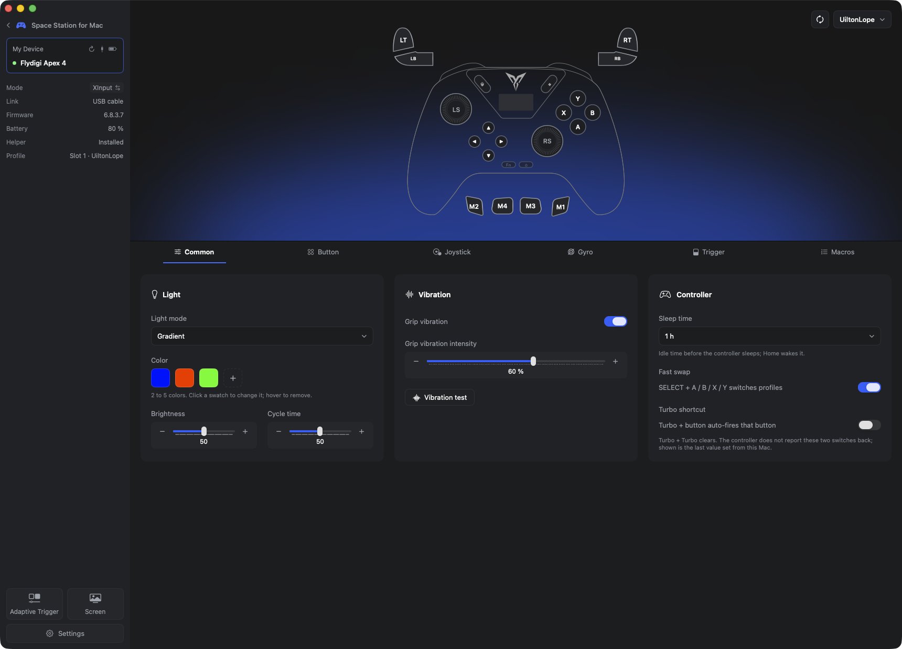
</p>

## Contents

- [Screenshots](#screenshots)
- [Features](#features)
- [Install](#install)
- [How it works](#how-it-works)
- [Supported hardware](#supported-hardware)
- [Building and contributing](#building-and-contributing)
- [Command line](#command-line)
- [Credits and disclaimer](#credits-and-disclaimer)

## Screenshots

| | |
|---|---|
| 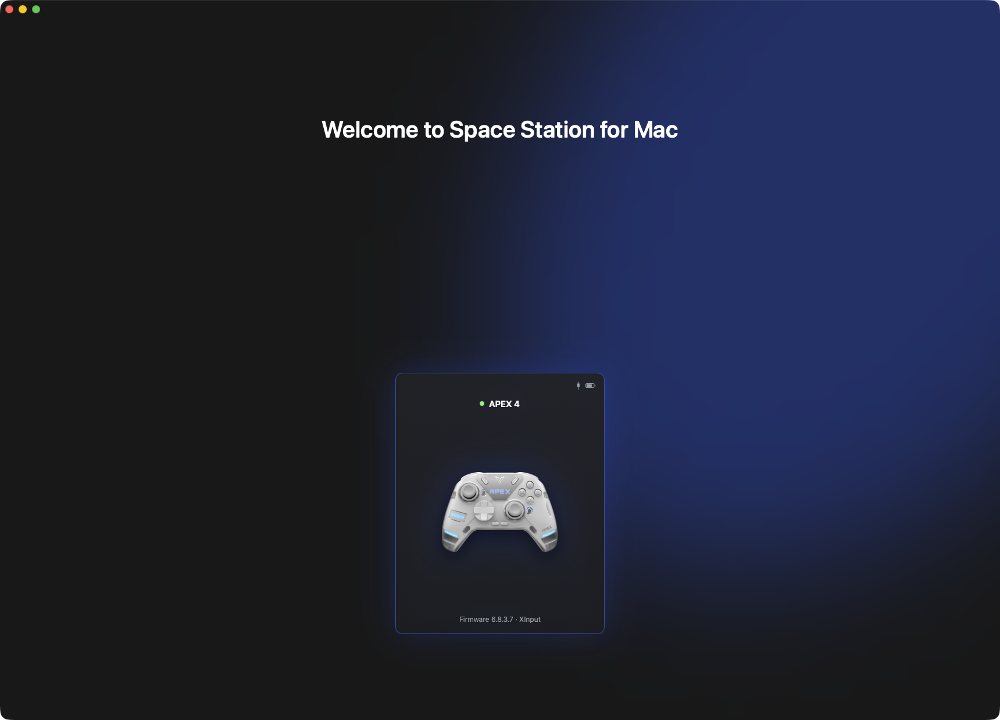 Welcome screen with the connected controller | 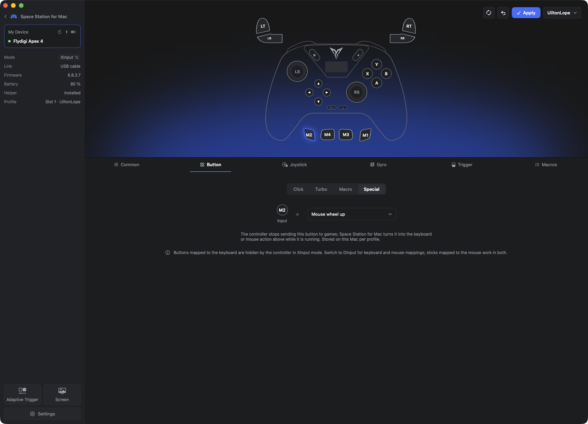 Buttons: click, turbo, macro or keyboard/mouse per key |
| 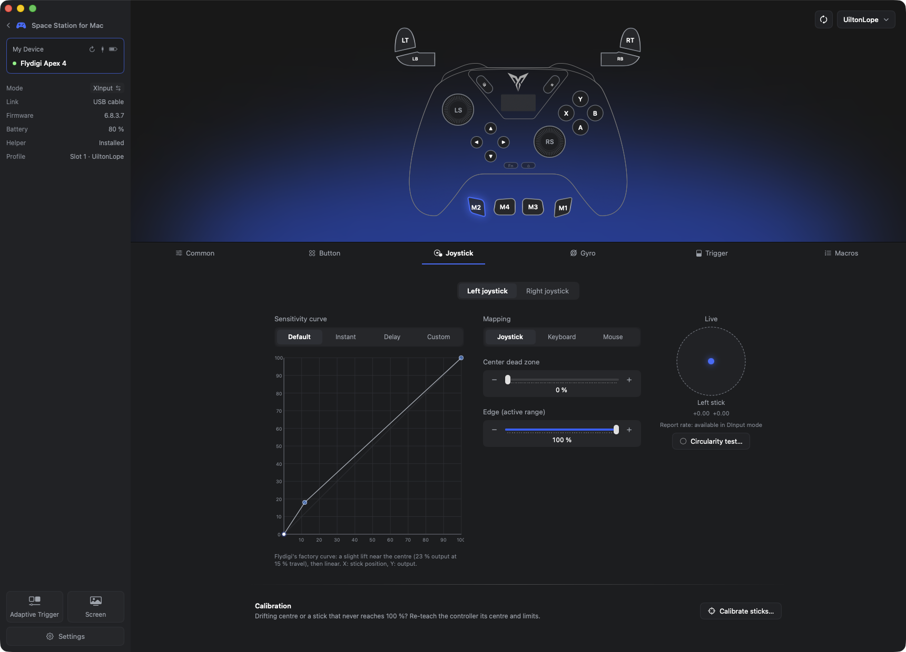 Sticks: Space Station's curve, dead zone, edge, live readout | 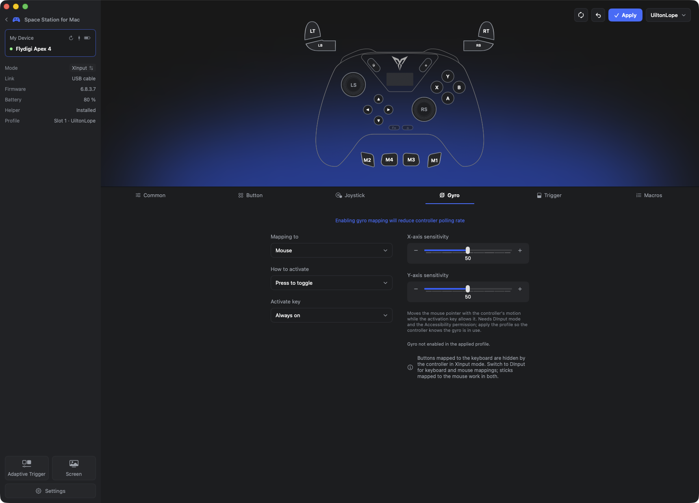 Gyro: map motion to a stick or the mouse |
| 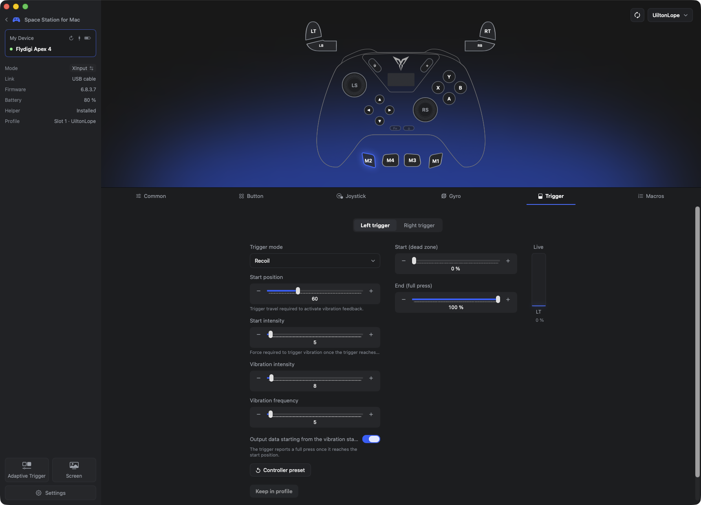 Triggers: ForceAdapt modes with live preview | 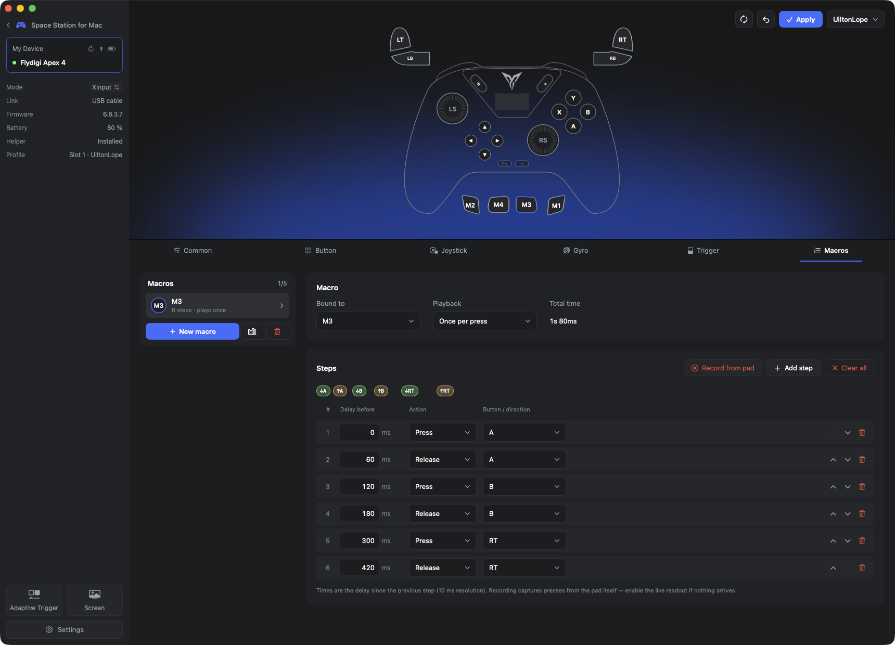 Macros: on-board sequences with a step editor |
| 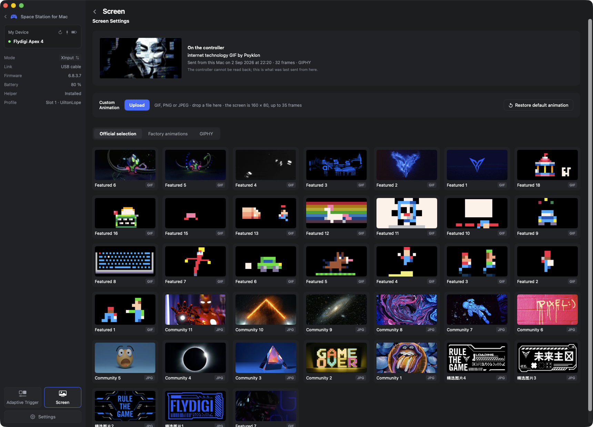 Screen: what is on the LCD and Flydigi's official animations | 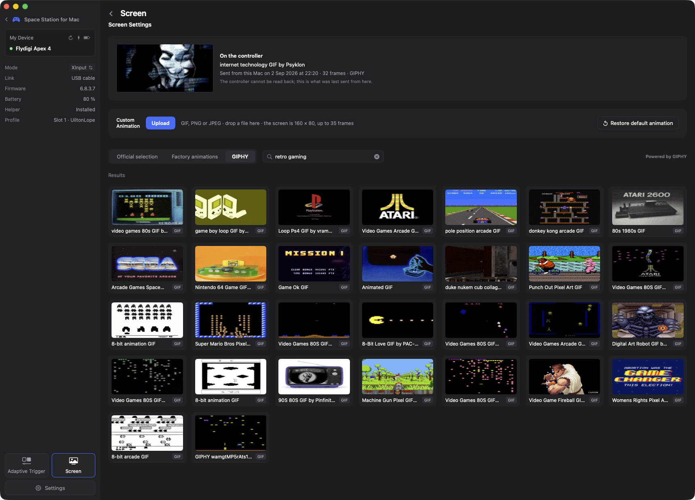 Screen: GIPHY search, sent to the LCD in one click |
| 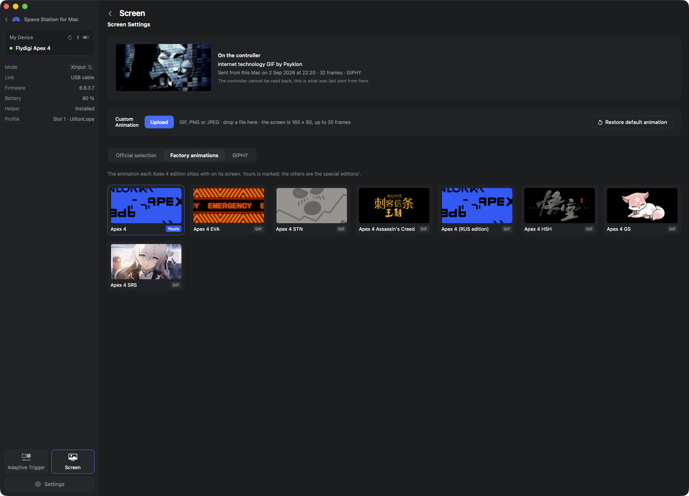 Screen: the factory animation of every Apex 4 edition | 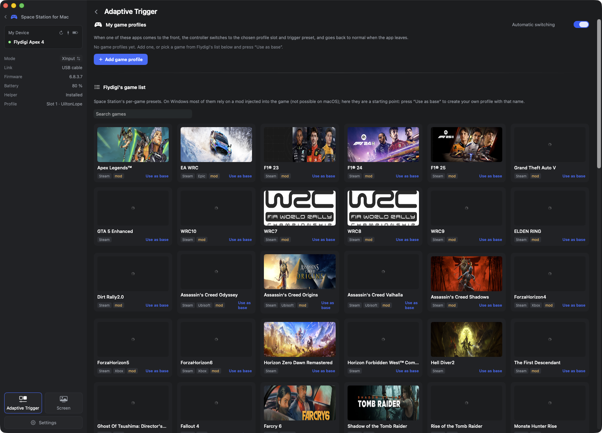 Adaptive Trigger: per-game profiles switched by the frontmost app |
| 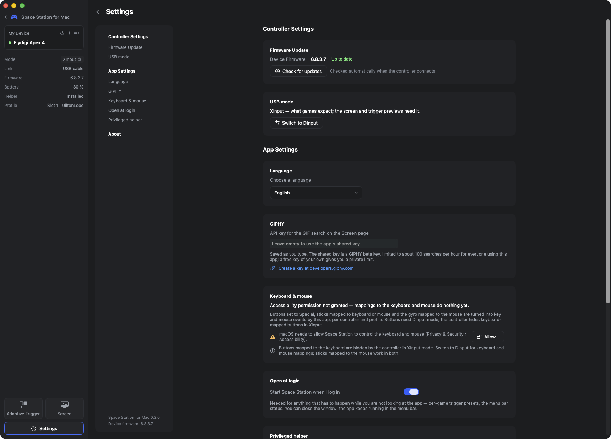 Settings: firmware update, USB mode, language, keyboard & mouse, helper | 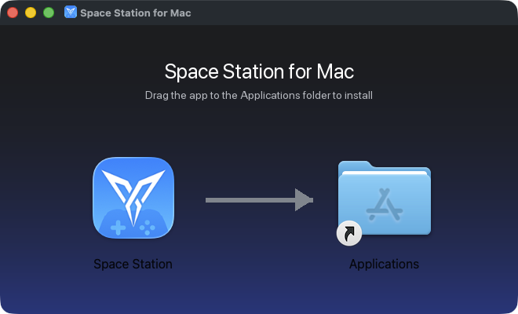 The DMG: drag to Applications, signed and notarized |

## Features

The layout follows Space Station 4, so an owner coming from Windows finds the same sections with the same
names. Everything is drawn with native SwiftUI controls; the app also lives in the menu bar.

### Device

- **Device card and welcome screen** with the connected model's picture, connection type (USB-C or the
  charging base's 2.4 GHz receiver), firmware and battery. Special editions get their own card artwork
  (EVA-01, Assassin's Creed, Black Myth: Wukong, Genshin Impact, Honkai: Star Rail).
- **Receiver aware.** With the charging base plugged in and the pad off, the app waits for the pad and
  reconnects on its own when it comes back, with the battery read correctly over the receiver.
- **Nickname** for the controller (right-click the card), **USB mode switch** (XInput ⇄ DInput) from the
  sidebar, refresh, and a firmware-update badge when Flydigi ships a newer version.
- **Menu bar** item with connection, battery, profile and quick actions.
- **URL scheme** for automation and Shortcuts: `spacestation://home?tab=buttons`, `spacestation://screen`,
  `spacestation://settings`, `spacestation://profile?slot=2`.

### Profiles

- The **4 on-board profile slots**: rename, apply, revert. The slot selected **on the pad itself** (fast swap
  or the screen menu) is respected, on connect and while switching.
- Lighting is stored **per slot**, like on the pad.
- **Restore default configuration** (the factory profile and lighting), **Apply to NS mode** (writes the
  profile into the Switch-mode slots), and a **local profile library**: save, load into the editor, rename,
  duplicate, reorder, delete, export and import as `.fdgprofile`.

### General tab

- **Lighting**: Default, Steady, Breathing, Gradient and Off, with the colour limits of each mode, up to five
  colours, brightness and cycle time. Changes apply live and are saved to the pad's flash.
- **Grip vibration**: on/off, intensity, and a test that rumbles the pad the way games do.
- **Controller**: sleep time (1 min to 3 h, or never), fast swap config (SELECT + A/B/X/Y switches the
  slot on the pad), and the Turbo hardware shortcut.

### Buttons

- Per-key mapping: **Click**, **Turbo**, **Macro** or **Special**, for every button including the paddles
  M1–M4. Special turns a button into a **keyboard key, left or right click, or mouse wheel**, generated by the
  app (Accessibility permission, DInput mode).
- **"Press it on the pad" capture** in both USB modes (in XInput the app borrows the pad for a few seconds
  so paddles and Fn are seen too).
- Every key lights up on the controller drawing as you press it.

### Sticks

- **Sensitivity curve drawn like Space Station**: Default, Instant, Delay and Custom presets, four
  draggable nodes, dead-zone and edge bands, and a live dot for the current deflection.
- Centre dead zone and edge, per stick. Or map a stick to the **keyboard** (4 or 8 directions, W A S D by
  default) or to the **mouse** (dead zone, X and Y sensitivity).
- **Report-rate meter** and a **circularity test** with coverage and average error (Space Station's advanced
  test page), plus a **guided calibration** of sticks and triggers.

### Gyro

- Map motion to a stick or to the **mouse**, choose the activation key and a second key, the activation type,
  sensitivity, dead zone and use mode.

### Triggers (ForceAdapt)

- The Apex 4's modes with Space Station's names and parameters: **General**, **Racing**, **Recoil**,
  **Sniper**, **Trigger lock** (three levels) and **Vibration** (synced with the grip motors).
- **Live preview while you drag** any slider, no apply button needed, and a **"Controller preset"** button
  that restores the pad's own defaults for each mode (read from the pad, not guessed).
- Start and end points, output strength, and a vibration test.

### Macros

- On-board macros with a **step editor** (key, press/release, delay), reordering, **recording from the pad**,
  and once / hold-to-loop / toggle playback.
- **Local macro library**: save from a profile, add to any profile on a free button, rename, duplicate,
  export and import as `.fdgmacro`.

### Screen (LCD)

- **Editor** for GIF, PNG and JPEG: drag, pinch and scroll to frame the image in the 2:1 viewport, Fit /
  Fill, GIF trimming with a filmstrip, frame interval (really sent to the pad), and an exact 160 × 80
  preview. Long GIFs are thinned evenly to the pad's 35-frame limit.
- Sources: Flydigi's **official animation library**, the **factory animations** of every Apex 4 edition,
  and **GIPHY search** (a shared key is bundled; add your own in Settings).
- **"On the controller"** card with the last animation sent from this Mac, and **Restore default animation**.
- Upload needs the cable and XInput mode; the receiver does not forward it.

### Adaptive Trigger (per-game profiles)

- Pick an app, a profile slot, ForceAdapt presets and lighting: the app switches the pad when that game is
  in front and puts everything back when it leaves. Flydigi's per-game preset list is the starting point.
  This is the macOS take on Space Station's game mods, which need Windows drivers.

### Settings

- **Firmware update** from the Mac: automatic check on connect, Flydigi's release note (translated
  on-device), and the update itself over USB, the same OTA sequence Space Station uses. The app refuses to
  run it over the receiver or below 40 % battery; profiles, lighting and the screen animation are kept.
- USB mode, language (English, Português do Brasil), GIPHY key, keyboard and mouse permission, open at login,
  privileged helper install and removal, about and support.

## Install

Download `SpaceStation-<version>.dmg` from the
[Releases](https://github.com/uiltonlopes/flydigi-space-station-mac/releases) page and drag the app to
Applications. Release builds are Developer ID signed and notarized, so they open like any other app.

In **XInput** mode (the pad's default) the app needs its privileged helper: Settings → **Install helper**,
approve it once in *Login Items & Extensions*. In **DInput** mode nothing is needed. Full steps, the mode
comparison and uninstall notes are in [`docs/install.md`](docs/install.md); changes per version in
[`CHANGELOG.md`](CHANGELOG.md).

## How it works

Flydigi only ships configuration software for Windows. The Apex 4 works as a gamepad on macOS, but
lighting, LCD, triggers, sticks and profiles cannot be changed, and a Windows VM cannot help because Apple's
own Xbox driver claims the device first.

- In **DInput** mode the pad exposes a vendor HID interface macOS leaves alone. The app talks to it
  directly with `IOHIDManager`: no privileges, no helper.
- In **XInput** mode Apple's driver owns the device. A small privileged helper, registered once with
  `SMAppService`, borrows the USB interface through IOUSBLib only while a command runs and hands it back.
  The LCD upload needs this mode.
- Live input comes from the GameController framework in both modes; in DInput the raw report is decoded
  as well, so paddles, Fn and Home are visible.
- Screen images are LVGL v8 frames, RGB565 big-endian, 160 × 80, up to 35 frames.
- The 790-byte profile blob and the 500-byte LED blob are decoded byte for byte and round-trip exactly.

Everything is written from scratch in Swift 6 from knowledge of the wire protocol. Reference material:
[`docs/protocol.md`](docs/protocol.md) (commands, blobs, quirks, all verified on hardware or marked as
not), [`docs/architecture.md`](docs/architecture.md), [`docs/spacestation4-analysis.md`](docs/spacestation4-analysis.md)
(what Space Station 4 does and how), [`docs/firmware-update.md`](docs/firmware-update.md).

## Supported hardware

| Controller | Device id | Status |
|---|---|---|
| Flydigi Apex 4 (`k2`) | 84 | supported, tested on firmware 6.8.3.0 and 6.8.3.7 (updated from the app's flasher) |
| Apex 4 EVA-01 / STN / Assassin's Creed / GS / Black Myth / Genshin / Star Rail | 86, 87, 92, 93, 102, 103, 104 | same protocol and artwork, untested |
| Apex 3, Vader 3 / 3 Pro, older | see `DeviceCatalog.swift` | classic protocol, unsupported (help wanted) |
| Apex 5 / 6, Vader 4 Pro, Vader 5 | 128+ | new protocol (VID 0x37D7), unsupported |

USB-C cable or the charging base's 2.4 GHz receiver (screen upload is cable-only). Bluetooth cannot be
configured. To add another Flydigi model read [`docs/adding-a-controller.md`](docs/adding-a-controller.md).

## Building and contributing

```
SpaceStation/     the app (SwiftUI) and the privileged helper; project.yml is the xcodegen spec
FlydigiKit/       Swift package: protocol, transports, blobs, models, apex4 CLI, tests
scripts/          release.sh: build, sign, notarize, staple, DMG
docs/             protocol, architecture, roadmap, firmware research, SS4 analysis, install and release guides
```

Build and run the app:

```bash
brew install xcodegen
```

```bash
cd SpaceStation && xcodegen generate && xcodebuild -project SpaceStation.xcodeproj -scheme SpaceStation -configuration Debug -derivedDataPath build -destination 'platform=macOS' build && open "build/Build/Products/Debug/Space Station.app"
```

The helper can only be registered when app and helper are signed by the same team: add your Apple ID in
Xcode (a free account is enough) and set `DEVELOPMENT_TEAM` in `SpaceStation/project.yml`. Releases are
described in [`docs/release.md`](docs/release.md).

Package and tests:

```bash
cd FlydigiKit && swift build && swift test
```

Issues and pull requests are welcome, especially from owners who can test other firmware versions, other
Apex 4 editions, or who want to add another Flydigi model. Please **do not** commit Flydigi binaries or
decompiled sources; document what the bytes mean, not their code.

## Command line

`apex4` sits on the same package as the app and works without it. In DInput mode no privileges are needed;
XInput commands need root (or the helper through the app).

```bash
cd FlydigiKit && swift build
```

```bash
.build/debug/apex4 info                     # model, firmware, battery, mode
```

```bash
.build/debug/apex4 led steady ff0000        # lighting, saved to flash
```

```bash
.build/debug/apex4 config dump ./backup     # the four profile slots as files (restore puts them back)
```

```bash
.build/debug/apex4 firmware check           # asks Flydigi for updates, read-only
```

```bash
.build/debug/apex4 firmware flash --yes     # main-chip update over USB (DInput, cable, battery ≥ 40 %)
```

```bash
sudo .build/debug/apex4 screen my.gif       # LCD upload (XInput, cable)
```

Also: `mode` (switch USB mode), `helper` (talk to the installed helper), `api` (Flydigi's GIF library,
game presets, firmware feed) and `dev` (protocol probes used while reverse-engineering).

## Support the project

Space Station for Mac is free and open source, built in spare time by reverse-engineering the controller.
If it saved you a Windows install, **[buy me a coffee](https://buymeacoffee.com/uiltonlopes)** ☕, star the
repo, or tell other Flydigi owners on a Mac.

## Credits and disclaimer

Controller artwork, app icon, card backgrounds and factory animations are © Flydigi and are used for
interoperability only; see the [NOTICE](SpaceStation/App/Resources/Flydigi/NOTICE.md) next to them.
Everything else is MIT. Not affiliated with Flydigi. Writing to the controller's flash and LCD is at your
own risk; tested on one unit.
